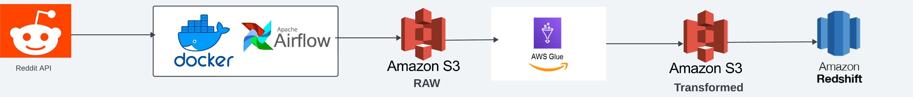
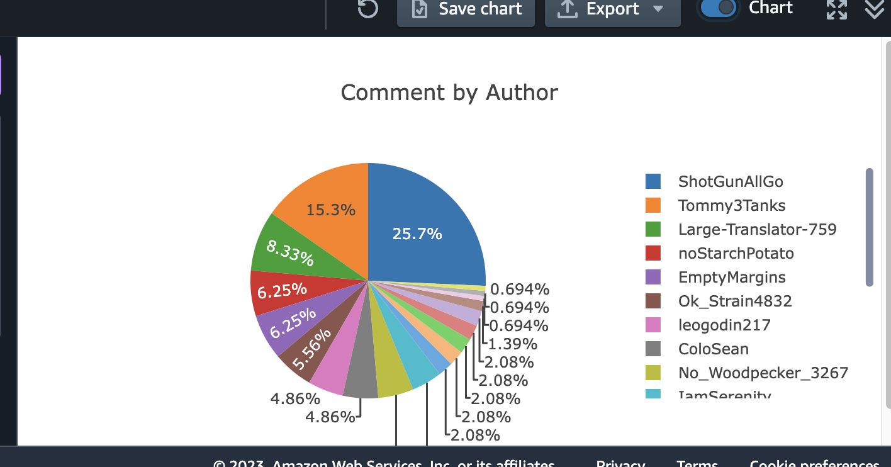

# Reddit AWS Data Engineering| Modern Data Engineering AWS Project

## Introduction

The goal of this project is to create an end-to-end pipeline using Docker, Airflow, AWS S3, AWS Glue, and AWS Redshift

## Architecture 


## Technology Used
- Programming Language - Python
- Orchestration Tool - Docker + Airflow

AWS Cloud Platform
1. AWS S3 
2. AWS Glue
3. AWS RedShift

## Reddit API
1. Please go to https://www.reddit.com/prefs/apps/ to create a Reddit App to get your Client and Secret Key.

## Instruction to start the project
1. Clone my project
2. Go to config/config.conf to fill in all the keys needed to run the project
3. Run ```pip install -r /path/to/requirements.txt.``` to get all the packages needed.
4. Run ```docker compose up -d --build``` to build docker image and start running Airflow
5. Go to Airflow and trigger the DAG
6. Go to AWS S3 and start playing using AWS services like AWS Glue, AWS Athena, AWS Redshift,...

## Charts
Here is a simple pie chart created from AWS Redshift that shows the percentage of comments in each author's post.

